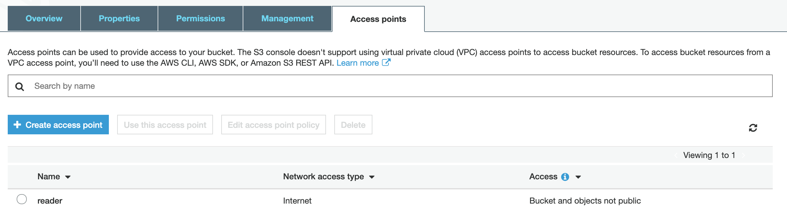
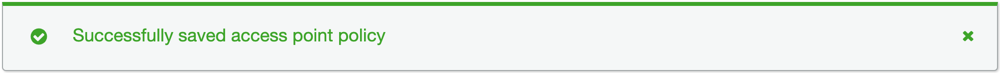

Go to AWS Console and navigate to S3 Service

 

Here, choose your bucket and select access point tab

---

 

Select your access-point and scroll down to reach the **Access point policy** section.

---

 

Click edit and copy this policy. You may use policy-generator as well

<pre class="file" data-filename="docker-compose.yml" data-target="replace">
{
    "Version": "2012-10-17",
    "Statement": [
        {
            "Effect": "Deny",
            "Principal": "*",
            "Action": "s3:PutObject",
            "Resource": "arn:aws:s3:REGION:ACCOUNT_NUM:accesspoint/reader/object/*"
        }
    ]
}
</pre>

---

 

Save it and you should get a message similar to the one below

---

 

Now try to put-object and it should fail